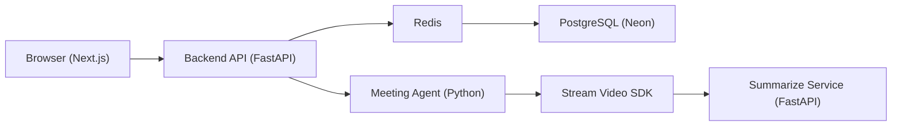

# MeetNote

## Project Overview
MeetNote is a real‑time meeting platform delivering:
- **Web client** built with Next.js for meeting UI, live transcript, chat, and AI‑generated summary screens.
- **Backend API** (FastAPI) handling authentication, meeting lifecycle, transcript ingestion, chat, and analytics.
- **Meeting Agent** (Python) that runs the AI assistant, processes transcript events and posts assistant messages.
- **Summarize Service** (FastAPI) that generates meeting summaries and provides PDF/DOCX export endpoints.
- **Neon PostgreSQL** for persistent data storage.
- **Groq** for LLM inference.
- **Stream Video SDK** for video and real‑time events.

## Architecture

### High‑Level Data Flow



## Core Features
- **Meeting lifecycle** – create, join (code & passcode), end, host transfer.
- **Video & Stream** – real‑time video with Stream SDK, event handling.
- **Live transcript** – webhook ingestion, stabilization, deduplication, WebSocket streaming.
- **Chat** – Redis‑backed message buffer, WebSocket broadcast.
- **AI Assistant** – context‑aware responses posted to chat.
- **Summarization** – AI‑generated summaries, PDF/DOCX export, email.


## Local Development Setup
```bash
# Clone repo
git clone 
cd MeetNote

# Backend services (run each in separate terminals)
uv run python backend/agent/main.py                 # Meeting Agent
uv run python -m uvicorn backend/api/app/main:app --port 8001   # API
uv run python -m uvicorn backend/summarize/app/main:app --port 8002   # Summarize

# Frontend
cd frontend
npm install
npm run dev   # Next.js dev server (http://localhost:3000)
```

## Environment Variables (names only)
- `DATABASE_URL`
- `REDIS_URL`
- `STREAM_API_KEY`
- `STREAM_API_SECRET`
- `GROQ_API_KEY`
- `JWT_SECRET`
- `CLOAK_CLIENT_ID`
- `CLOAK_CLIENT_SECRET`

## Current Project Status
- **Authentication** – ✅ Complete (JWT & Clerk integration)
- **Meeting Lifecycle** – ✅ Production‑grade
- **Video Integration** – ✅ Fixed SDK race condition
- **Assistant Agent** – ✅ Stable
- **Summarization Service** – ✅ FastAPI implementation, replaces legacy Node.js service
- **Database Migration** – ✅ Switched to Neon PostgreSQL
- **Export Design** – ✅ Professional PDF/DOCX layouts

  
